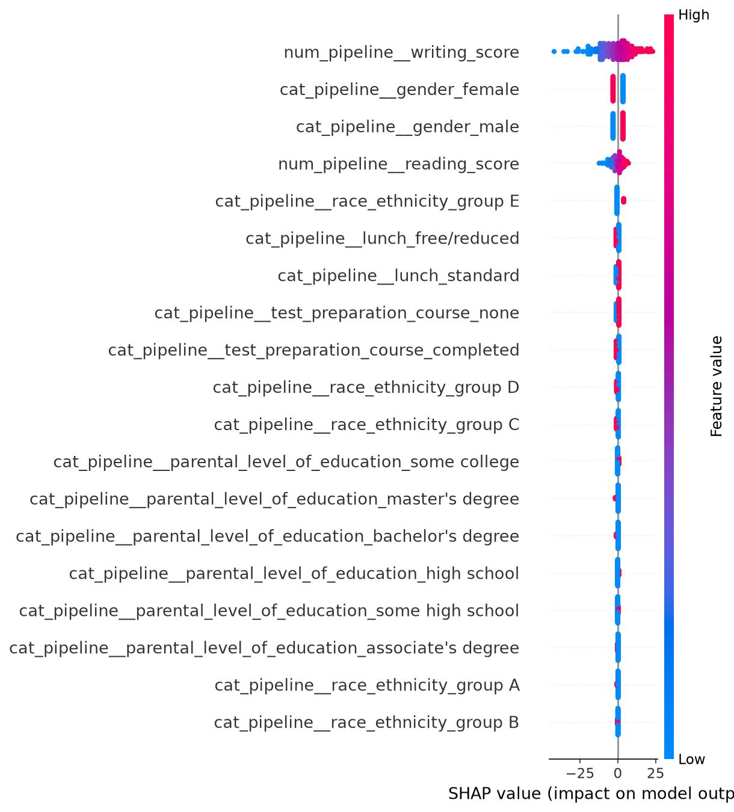
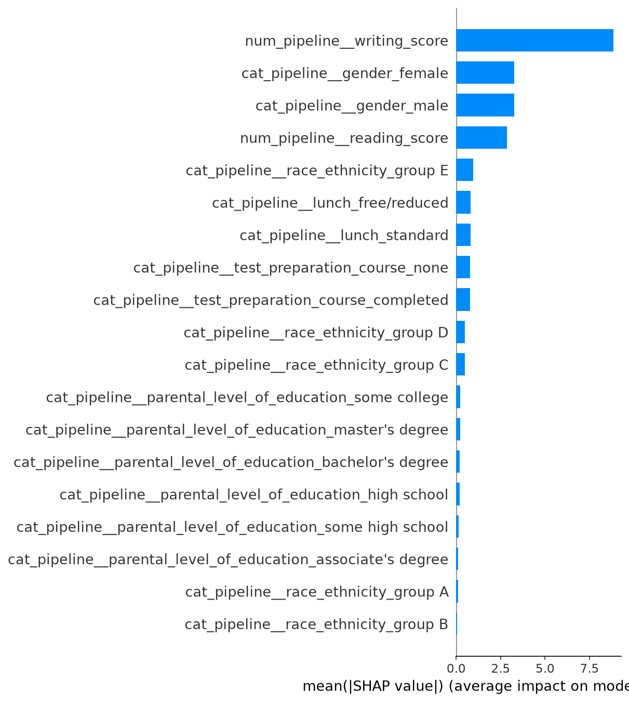
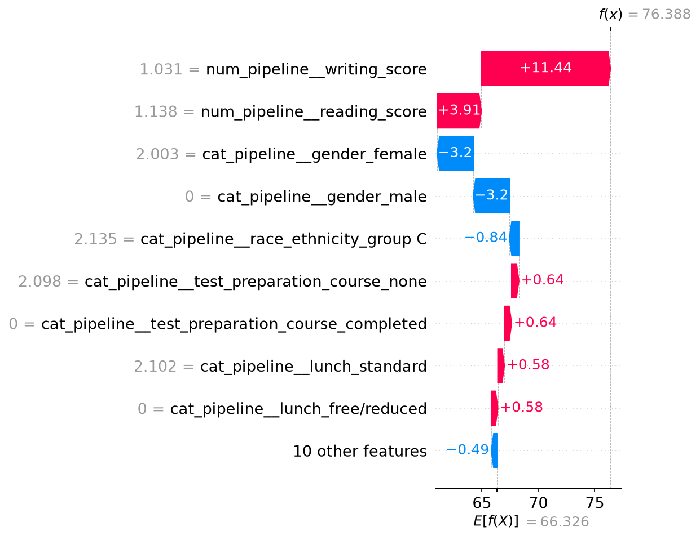

# 🎓 Student Performance Prediction — End-to-End ML Project

A production-style machine learning project that predicts student math scores based on demographic and academic inputs. Built with a modular pipeline architecture, MLflow experiment tracking, SHAP explainability, and a Flask web app for live inference.

---

## 📁 Project Structure

```
DataScience_end_to_end_project/
├── artifact/                    # Auto-generated outputs from pipeline runs
│   ├── data.csv                 # Raw ingested data
│   ├── train.csv                # Train split
│   ├── test.csv                 # Test split
│   ├── preprocessor.pkl         # Saved ColumnTransformer
│   ├── model.pkl                # Best trained model
│   └── shap_plots/              # SHAP explainability plots
│
├── docs/                        # README-referenced assets (SHAP plots)
│
├── notebook/                    # Exploratory work
│   ├── data/study.csv           # Raw dataset
│   ├── 1_EDA.ipynb              # Exploratory Data Analysis
│   └── model-training.ipynb     # Baseline model experiments
│
├── src/                         # Core source package
│   ├── components/
│   │   ├── data_ingestion.py    # Reads raw data, creates train/test splits
│   │   ├── data_transformation.py  # Preprocessing pipelines (scaling, encoding)
│   │   ├── model_trainer.py     # Model training, MLflow tracking, evaluation
│   │   └── model_explainer.py   # SHAP explainability plots
│   ├── pipelines/
│   │   ├── train.py             # Orchestrates full training pipeline
│   │   └── predict.py           # Inference pipeline for single predictions
│   ├── exception.py             # Custom exception handling
│   ├── logger.py                # Centralized logging setup
│   └── utils.py                 # Shared utilities (save/load, model evaluation, MLflow logging)
│
├── templates/                   # Flask HTML templates
│   ├── index.html               # Landing page
│   └── home.html                # Prediction form
│
├── logs/                        # Runtime logs (auto-generated)
├── app.py                       # Flask web application
├── setup.py                     # Package setup
└── requirements.txt             # Dependencies
```

---

## 🧠 Problem Statement

Predict a student's **math score** based on: gender, race/ethnicity, parental level of education, lunch type, test preparation course, reading score, and writing score.

**Type:** Regression
**Target:** `math_score` (continuous)

---

## ⚙️ ML Pipeline

```
Raw CSV
  └─► Data Ingestion          → train.csv / test.csv
        └─► Data Transformation  → preprocessor.pkl (StandardScaler + OneHotEncoder)
              └─► Model Trainer      → trains 8 models, tracks every run in MLflow
                    └─► Model Explainer  → SHAP plots for the winning model
                          └─► model.pkl saved
```

Every training run is tracked end-to-end: hyperparameters, metrics, and the model artifact itself are logged to MLflow, and the winning model is automatically explained with SHAP.

---

## 📊 Model Results

8 models were trained with `GridSearchCV` (3-fold CV) and compared on held-out test data:

| Model                    | Test R²    | MAE  | RMSE  |
| ------------------------ | ---------- | ---- | ----- |
| **Linear Regression** 🏆 | **0.8804** | 4.21 | 5.39  |
| CatBoost                 | 0.8742     | 4.24 | 5.53  |
| Gradient Boosting        | 0.8711     | 4.30 | 5.60  |
| XGBoost                  | 0.8626     | 4.36 | 5.78  |
| Random Forest            | 0.8511     | 4.59 | 6.02  |
| AdaBoost                 | 0.8490     | 4.70 | 6.06  |
| Decision Tree            | 0.8242     | 4.93 | 6.54  |
| K-Neighbors Regressor    | 0.5644     | 7.81 | 10.30 |

**Linear Regression won** despite the field including gradient-boosted ensembles — this indicates the relationship between reading/writing scores and math score is strongly linear in this dataset, and a simpler, more interpretable model generalizes better here than higher-variance ensemble methods.

---

## 🔬 Experiment Tracking with MLflow

Every model run — across every retraining of the pipeline — is logged with:

- Hyperparameters (best params found via GridSearchCV)
- Train/test R², MAE, RMSE
- The serialized model itself (via the appropriate native flavor: `mlflow.sklearn`, `mlflow.xgboost`, `mlflow.catboost`)
- SHAP plots attached as run artifacts

### View the experiment locally

```bash
mlflow ui --backend-store-uri sqlite:///mlflow.db --port 5001
```

Open `http://localhost:5001` to browse the **"Student Performance Prediction"** experiment — one parent run per training session, with 8 nested child runs (one per model).

---

## 🔍 Model Explainability with SHAP

The winning model is explained using SHAP (SHapley Additive exPlanations), which decomposes every prediction into per-feature contributions.

| Plot                 | What it shows                                              |
| -------------------- | ---------------------------------------------------------- |
| `shap_summary.png`   | Per-sample feature impact and direction (beeswarm)         |
| `shap_bar.png`       | Ranked global feature importance                           |
| `shap_waterfall.png` | Breakdown of a single prediction from base value to output |

<p align="center">
  
</p>

<p align="center">
  
</p>

<p align="center">
  
</p>

`TreeExplainer` is used for tree-based models (XGBoost, CatBoost, Random Forest, etc.) and `LinearExplainer` for linear models — never the slow, model-agnostic `KernelExplainer`.

---

## 🚀 Getting Started

### 1. Clone the Repository

```bash
git clone https://github.com/<your-username>/DataScience_end_to_end_project.git
cd DataScience_end_to_end_project
```

### 2. Create & Activate Virtual Environment

```bash
python -m venv venv
# Windows
venv\Scripts\activate
# macOS/Linux
source venv/bin/activate
```

### 3. Install Dependencies

```bash
pip install -r requirements.txt
```

### 4. Run the Training Pipeline

```bash
python src/pipelines/train.py
```

This will:

- Ingest data and create train/test splits
- Fit the preprocessing pipeline
- Train and tune 8 regression models with GridSearchCV
- Log every run to MLflow (`mlflow.db`)
- Save the best model to `artifact/model.pkl`
- Generate SHAP explainability plots to `artifact/shap_plots/`

### 5. View Experiment Tracking

```bash
mlflow ui --backend-store-uri sqlite:///mlflow.db --port 5001
```

### 6. Launch the Web App

```bash
python app.py
```

Open `http://localhost:5000`, fill in the student details, and get a predicted math score.

---

## 🐳 Run with Docker

Build and run the Flask prediction app in an isolated container — no local Python environment needed.

\`\`\`bash
docker build -t student-perf-predictor .
docker run -p 5000:5000 student-perf-predictor
\`\`\`

Open \`http://localhost:5000\` to use the app. The image bundles only the trained model artifacts (\`model.pkl\`, \`preprocessor.pkl\`) and the Flask serving code — training is run separately and is not containerized, following standard ML production practice of decoupling offline training from online serving.

## 🌐 Web Application

Built with **Flask**. The prediction form (`home.html`) takes:

| Feature                     | Type        |
| --------------------------- | ----------- |
| Gender                      | Categorical |
| Race/Ethnicity              | Categorical |
| Parental Level of Education | Categorical |
| Lunch Type                  | Categorical |
| Test Preparation Course     | Categorical |
| Reading Score               | Numeric     |
| Writing Score               | Numeric     |

The `/predictdata` route calls `PredictPipeline`, which loads `preprocessor.pkl` + `model.pkl` and returns the predicted math score.

---

## 📊 EDA Highlights

Covered in `notebook/1_EDA.ipynb`:

- Target distribution and outlier analysis
- Feature correlations — reading and writing scores are strongly correlated with math score
- Group-wise performance breakdown by gender, parental education, and test preparation

---

## 🛠 Tech Stack

| Layer               | Tools                           |
| ------------------- | ------------------------------- |
| Language            | Python 3.x                      |
| ML Libraries        | scikit-learn, XGBoost, CatBoost |
| Experiment Tracking | MLflow (SQLite backend)         |
| Explainability      | SHAP                            |
| Web Framework       | Flask                           |
| Data                | pandas, numpy                   |
| Logging             | Python `logging` module         |
| Serialization       | `dill`                          |
| Notebook            | Jupyter                         |

---

## 📝 Logging & Exception Handling

- All pipeline stages log to `logs/` with timestamps via `src/logger.py`
- Custom `CustomException` in `src/exception.py` captures file name and line number for clean tracebacks

---

## 📦 Package Setup

The `src/` directory is installable as a local package via `setup.py`:

```bash
pip install -e .
```

This enables clean imports like `from src.components.model_trainer import ModelTrainer` across the project.

---

## 🗺 Roadmap

- [x] Modular ingestion → transformation → training pipeline
- [x] MLflow experiment tracking with nested runs and model registry
- [x] SHAP explainability (summary, bar, waterfall plots)
- [x] Dockerized deployment
- [ ] CI/CD with GitHub Actions
- [ ] Data validation / drift monitoring

---

## 📋 Changelog

- **v1.2.0** — Added SHAP explainability (summary, bar, waterfall plots), auto-logged to MLflow as run artifacts
- **v1.1.0** — Added MLflow experiment tracking with nested runs, metrics, and model registry across 8 models
- **v1.0.0** — Baseline modular pipeline with Flask deployment; fixed a reading_score/writing_score field swap bug in the prediction form

---

## 🙋 Author

**Gautam Mishra**
Data Science & AI/ML | Fresher
[LinkedIn](https://linkedin.com/in/) • [GitHub](https://github.com/)

---

## 📄 License

This project is licensed under the terms of the [LICENSE](LICENSE) file.
